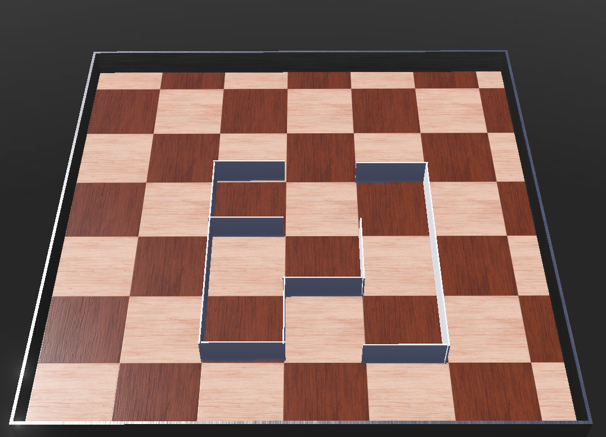

### ตัวอย่าง แบบเลียบกำแพงซ้ายของแมพ  
[](https://www.youtube.com/watch?v=JhTG65Doav0)

### ตัวอย่าง แบบเลียบกำแพงขวาของแมพ  
[](https://www.youtube.com/watch?v=Tb_xd7OpwnI)

### ตัวอย่าง แบบเริ่มมาไม่เจอกำแพงด้านไหนเลยจะเดินตรง  
[](https://www.youtube.com/watch?v=997iP3TYkYc)

---
# Adaptive Wall-Following Robot (Webots Simulation)

โปรเจคนี้จำลองการทำงานของหุ่นยนต์ **differential drive robot** ที่ใช้อัลกอริธึม **adaptive wall-following** ใน Webots โดยใช้ **infrared proximity sensors** และ **wheel encoder-based odometry** หุ่นยนต์สามารถตัดสินใจเลือกติดตาม left wall หรือ right wall ได้เองตามสถานการณ์รอบข้าง

---

## Features

- **Adaptive wall-following** (ตัดสินใจ left/right ตาม environment แวดล้อม)
- **State-based behavior control**: drive, turn, steer ตามตำแหน่งของ wall
- **2D Odometry** ผ่าน wheel encoders (`x`, `y`, `theta`)
- **CSV logging** ที่บันทึก:
  - Position (`x`, `y`)
  - Orientation (`theta`)
  - Proximity values (left, right, front)
- ออกแบบสำหรับ Webots simulation environment

---





## ทำไมต้องสร้างแมพแบบนี้ (Maze Design Rationale)

### จุดประสงค์ของ Maze Layout
แมพนี้ถูกออกแบบมาเป็นพิเศษเพื่อทดสอบความสามารถของ **wall-following algorithm** ในสถานการณ์ต่างๆ:

#### 1. **Complex Corner Testing**
- **Inner corners** (มุมเว้าเข้า): ทดสอบการ detect และ navigate รอบมุมที่ซับซ้อน
- **Outer corners** (มุมนูนออก): ทดสอบการ reacquire wall เมื่อหุ่นยนต์เดินผ่านมุมนี้
- **90-degree turns**: ทดสอบการหักเลี้ยวมุมฉาก

#### 2. **Wall Transition Scenarios**
- **Long straight walls**: ทดสอบการเดินตรงและรักษาระยะห่างจากกำแพง
- **Gap detection**: ทดสอบการหา opening หรือช่องว่างในกำแพง
- **Wall reconnection**: ทดสอบความสามารถในการหากำแพงใหม่เมื่อสูญเสียการติดตาม

#### 3. **Decision Making Challenges**
- **T-junctions**: ทดสอบการตัดสินใจเมื่อมี multiple paths
- **Dead ends**: ทดสอบการ U-turn และ backtracking
- **Multiple wall options**: ทดสอบ adaptive decision ระหว่าง left/right wall

#### 4. **Algorithm Robustness**
- ทดสอบให้หุ่นยนต์เดินใน **closed loop** เพื่อดูว่า algorithm มี consistency
- ทดสอบ **sensor reliability** ในสภาพแวดล้อมที่มี noise หรือ interference
- ทดสอบ **state transition** ระหว่าง different behaviors

---

## การทำงานของโค้ด (Code Flow Explanation)

### Phase 1: Initialization & Setup
```python
def run_robot(robot):
    timestep = int(robot.getBasicTimeStep())
    max_speed = 6.28
```
**หน้าที่:** กำหนด basic parameters และ setup เซนเซอร์ทั้ง 8 ตัว

### Phase 2: Wall Detection (ระยะสำรวจกำแพง)
```
Robot เริ่มต้น → เคลื่อนที่ forward → สแกนหา walls
```
**Process:**
1. **เคลื่อนที่ไปข้างหน้า** ด้วยความเร็วปกติ
2. **อ่านค่า sensors ทั้ง 8 ตัว** ทุก timestep
3. **วิเคราะห์ wall positions:**
   - `ps5, ps6` = Left wall detection
   - `ps2, ps1` = Right wall detection  
   - `ps7, ps0` = Front wall detection
4. **ตัดสินใจ wall_follow_mode:**
   ```python
   if left_wall_detected and not right_wall_detected:
       wall_follow_mode = 'left'
   elif right_wall_detected and not left_wall_detected:
       wall_follow_mode = 'right'
   elif left_wall_detected and right_wall_detected:
       wall_follow_mode = 'left'  # Default choice
   elif front_wall_detected:
       wall_follow_mode = 'left'  # Default choice
   ```

### Phase 3: State Machine Execution

## รายละเอียด State Machine Architecture

### Finite State Machine (FSM) Design
หุ่นยนต์ใช้ **Hierarchical State Machine** ที่มี 2 ระดับ:

```
Level 1: Wall Selection Mode
├── wall_follow_mode = None    (Detection Phase)
├── wall_follow_mode = 'left'  (Left Wall Following)
└── wall_follow_mode = 'right' (Right Wall Following)

Level 2: Behavior States (ภายในแต่ละ mode)
├── 'drive_forward'   (เดินตรงตาม wall)
├── 'turn_left'       (หมุนซ้ายหา wall)  
├── 'turn_right'      (หมุนขวาหลีกเลี่ยง/หา wall)
└── 'steer_left/right' (ปรับทิศทางแบบนุ่มนวล)
```

### State Transition Mechanism

#### 1. **Mode Selection State Machine:**
```python
# State: wall_follow_mode = None (Initial Detection)
if wall_follow_mode is None:
    left_wall_detected = sensor_vals[5] > 80 or sensor_vals[6] > 80
    right_wall_detected = sensor_vals[2] > 80 or sensor_vals[1] > 80  
    front_wall_detected = sensor_vals[7] > 80 or sensor_vals[0] > 80
    
    # State Transition Logic
    if left_wall_detected and not right_wall_detected:
        wall_follow_mode = 'left'     # Transition to Left Following
    elif right_wall_detected and not left_wall_detected:
        wall_follow_mode = 'right'    # Transition to Right Following
    elif left_wall_detected and right_wall_detected:
        wall_follow_mode = 'left'     # Default choice (ambiguous case)
    elif front_wall_detected:
        wall_follow_mode = 'left'     # Default choice (front wall only)
```

#### 2. **Left Wall Following State Machine:**

**State Diagram:**
```
        front_wall
    ┌─────────────────┐
    │                 │
    ▼                 │
┌──────────────┐     │    no_left_wall
│  turn_right  │     │  ┌──────────────┐
│              │◄────┼──┤              │
│ L: max_speed │     │  │  turn_left   │
│ R: -max_speed│     │  │              │
└──────────────┘     │  │ L: max_speed/8│
    │                │  │ R: max_speed  │
    │ no_front_wall  │  └──────────────┘
    ▼                │         ▲
┌──────────────┐     │         │
│drive_forward │     │         │ no_left_wall
│              │─────┘         │
│ L: max_speed │               │
│ R: max_speed │               │
└──────────────┘               │
    │                          │
    │ left_corner              │
    ▼                          │
┌──────────────┐               │
│ steer_right  │───────────────┘
│              │
│ L: max_speed │
│ R: max_speed/8│
└──────────────┘
```

**Priority-based State Selection:**
```python
# Left Wall Following - Priority Order (สูงสุดไปต่ำสุด)
if front_wall:              # Priority 1: Safety First
    current_state = 'turn_right'     
elif left_corner:           # Priority 2: Collision Avoidance  
    current_state = 'steer_right'    
elif left_wall:             # Priority 3: Normal Following
    current_state = 'drive_forward'  
else:                       # Priority 4: Wall Search
    current_state = 'turn_left'      
```

#### 3. **Right Wall Following State Machine:**

**Mirror Logic ของ Left Wall:**
```python
# Right Wall Following - Mirror State Logic
if front_wall:              # ps0 > 80
    current_state = 'turn_left'      # หมุนซ้ายหลีกเลี่ยง
elif right_corner:          # ps1 > 80  
    current_state = 'steer_left'     # ปรับซ้ายเล็กน้อย
elif right_wall:            # ps2 > 80
    current_state = 'drive_forward'  # เดินตรง
else:
    current_state = 'turn_right'     # หมุนขวาหา wall
```

### Motor Control State Mapping

#### **State-to-Motor Speed Translation:**

| State | Left Motor | Right Motor | Behavior Description |
|-------|------------|-------------|---------------------|
| `drive_forward` | `max_speed` | `max_speed` | เดินตรง - ทั้งสองล้อหมุนเท่ากัน |
| `turn_left` | `max_speed/8` | `max_speed` | หมุนซ้าย - ล้อขวาเร็วกว่า |
| `turn_right` | `max_speed` | `-max_speed` | หมุนขวาแบบแหลม - ล้อขวาถอยหลัง |
| `steer_left` | `max_speed/8` | `max_speed` | เลี้ยวซ้ายนุ่มนวล |
| `steer_right` | `max_speed` | `max_speed/8` | เลี้ยวขวานุ่มนวล |

#### **การคำนวณ Differential Drive:**
```python
# Differential Drive Kinematics
# Robot turns based on wheel speed difference
if current_state == 'turn_right':
    left_speed = max_speed      # ล้อซ้ายหมุนไปข้างหน้า
    right_speed = -max_speed    # ล้อขวาหมุนถอยหลัง
    # Result: Robot pivots right around center point
    
elif current_state == 'steer_right':
    left_speed = max_speed      # ล้อซ้ายเร็วเต็มที่
    right_speed = max_speed/8   # ล้อขวาเร็วเพียง 12.5%
    # Result: Robot curves right while moving forward
```

### State Machine Properties

#### **1. Deterministic Behavior:**
- **แต่ละ state มี conditions ชัดเจน** - ไม่มี ambiguous transitions
- **Priority system** ป้องกัน conflicting states
- **Consistent output** - state เดียวกันให้ motor speeds เดียวกัน

#### **2. Safety-First Design:**
```
Priority Hierarchy:
1. Front Wall (หลีกเลี่ยงการชน) → Highest Priority
2. Corner Detection (ป้องกันการติดมุม) → High Priority  
3. Wall Following (behavior ปกติ) → Normal Priority
4. Wall Search (หา wall ที่หายไป) → Lowest Priority
```

#### **3. Smooth Transitions:**
- **Steer states** ใช้ speed ratio (max_speed/8) แทน sharp turns
- **Gradual speed changes** ป้องกัน jerky motion
- **State persistence** - ไม่ oscillate ระหว่าง states

#### **4. Robustness Features:**
- **Default states** เมื่อเจอสถานการณ์ไม่ชัดเจน
- **Wall reacquisition** เมื่อสูญเสียการติดตาม
- **Sensor fusion** จาก multiple sensors ลดความผิดพลาด

### State Machine Debugging

**การติดตาม State Changes:**
```python
print(f"Wall Mode: {wall_follow_mode}, Current State: {current_state}")
print(f"Sensors - Left: {sensor_vals[5]}, Right: {sensor_vals[2]}, Front: {sensor_vals[7]}")
print(f"Motor Speeds - L: {left_speed:.2f}, R: {right_speed:.2f}")
```

**Common State Sequences:**
```
Typical Left Wall Following Sequence:
drive_forward → steer_right → drive_forward → turn_right → drive_forward → turn_left → drive_forward

Expected in Maze:
1. Straight wall: drive_forward
2. Approaching corner: steer_right  
3. Sharp corner: turn_right
4. Lost wall: turn_left
5. Found wall again: drive_forward
```

### Phase 4: Continuous Execution Loop
```
Loop: Read Sensors → Analyze → Decide State → Set Motors → Repeat
```

**Detailed Flow:**
1. **sensor_vals = [sensor.getValue() for sensor in prox_sensors]**
2. **State analysis ตาม wall_follow_mode**
3. **Motor speed calculation ตาม current_state**
4. **Apply speeds: left_motor.setVelocity(), right_motor.setVelocity()**
5. **กลับไป step 1**

### Key Design Decisions:

#### 1. **Threshold Value = 80**
- **ทำไม 80?** ค่านี้ให้ balance ระหว่าง sensitivity และ noise rejection
- **เกิน 80** = wall detected, **ต่ำกว่า 80** = free space

#### 2. **Speed Ratios**
- **max_speed** = การเดินตรงเต็มที่
- **max_speed/8** = การเลี้ยวแบบนุ่มนวล (12.5% ของความเร็วเต็ม)
- **-max_speed** = การหมุนย้อนกลับ (sharp turn)

#### 3. **Sensor Priority**
```
Front Wall > Corner Detection > Side Wall > No Wall
```
**ทำไม?** เพื่อป้องกันการชนและให้ smooth navigation

#### 4. **Default to Left Wall**
เมื่อเจอสถานการณ์ที่กำกวม (both walls หรือ front wall only) จะเลือก left wall เป็น default เพื่อ consistency

---

## How It Works

### Algorithm Summary

หุ่นยนต์ทำงานใน 2 phase หลัก:

1. **Wall Detection Phase**: เคลื่อนที่ forward พร้อม scan หา walls รอบข้าง
2. **Wall Following Phase**: เมื่อเจอ wall แล้วจะเปลี่ยนเป็น adaptive wall-following behavior

### ผลลัพธ์ที่ได้จาก Maze Design นี้

**การทดสอบที่สำคัญ:**
1. **Corner Navigation**: หุ่นยนต์จะต้องเจอ inner/outer corners หลายรูปแบบ
2. **Path Decision**: จะต้องตัดสินใจเมื่อเจอ T-junction และ multiple options  
3. **Loop Completion**: สามารถเดิน complete loop และกลับมาจุดเริ่มต้น
4. **State Consistency**: รักษา wall-following behavior ได้ตลอด simulation

**Expected Behaviors:**
- เริ่มที่ center → detect nearest wall → เลือก left/right following
- Navigate ผ่าน complex corners โดยใช้ 4 states: drive, steer, turn, search  
- สร้าง continuous path ที่เป็น systematic exploration
- ทดสอบ robustness ของ sensor readings และ decision making

---

## การ Configuration

Parameters ที่สามารถปรับได้ในโค้ด:

```python
max_speed = 6.28          # ความเร็วสูงสุดของ motor [rad/s]
wheel_radius = 0.0205     # รัศมีของล้อ [meters]  
axle_length = 0.053       # ระยะห่างระหว่างล้อซ้าย-ขวา [meters]
```

สามารถปรับแต่ง **wall detection threshold** (ปัจจุบันคือ 80) หรือ **logging intervals** ได้ใน code

---

## ข้อมูล CSV ที่บันทึก (Sample Logged Data)

แต่ละ row ใน log จะมี:

| Column        | รายละเอียด                               |
|---------------|------------------------------------------|
| `time_sec`    | เวลาใน simulation [วินาที]               |
| `x`, `y`      | ตำแหน่งของหุ่นยนต์ [เมตร]                |
| `theta_deg`   | มุม heading [องศา]                      |
| `left_dist`   | ค่าเซนเซอร์ตรวจจับกำแพงซ้าย                |
| `right_dist`  | ค่าเซนเซอร์ตรวจจับกำแพงขวา                |
| `front_dist`  | ค่าเซนเซอร์ตรวจจับกำแพงหน้า                |

---

## วิธีการรัน (How to Run)

1. เปิด **Webots**
2. Load world file:  
   ```
   worlds/mazerunner.wbt
   ```
3. รัน simulation
4. ตรวจสอบ log file ใน `/logs/robot_tracking_log.csv`

---

## Requirements

- Webots simulator
- Python controller support ใน Webots

---

## Author

Fantastic 4
